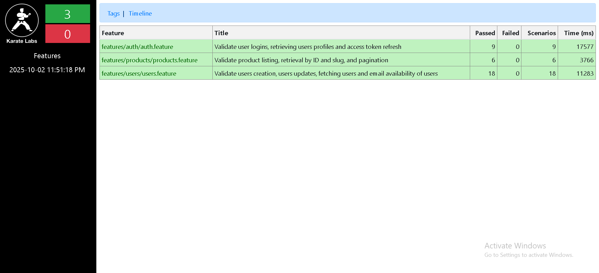

# Karate API Automation  Framework - Platzi Fake Store

## Overview:
**This project is a Karate-DSL API Automation framework, built to validate 
core endpoints and core logic of the Platzi Fake Store API. It covers users and 
authentication with both happy paths and negative scenarios.**

## Purpose:
Created this project to demonstrate my ability to design, implement and maintain
API test suits using Karate.

## How to Run
To execute the full suite run - `mvn test -Dtest=testRunner`

## Prerequisites
- Java 21.0.1
- Maven 
- Karate
- IntelliJ IDEA (or any IDE with Maven support)

## Project structure
* features/ – Contains all Karate feature files
* users/ – User-related scenarios
* auth/ – Authentication and profile tests
* requests/ – JSON payloads used in API requests
* utils/ – Reusable helper features (e.g. user creation)
* runners/ – JUnit test runners
* pom.xml – Maven configuration file

## Tags used
- @regression - Full suite run
- @login - Authentication scenarios
- @negative - Different edge case failure paths
- @smoke - Core endpoints check

## Test execution

## Next steps
- Add integration with Jenkins
- Expand coverage to other functionalities e.g. products, categories, locations
- With time enhance the code logic for easier readability and maintainability
